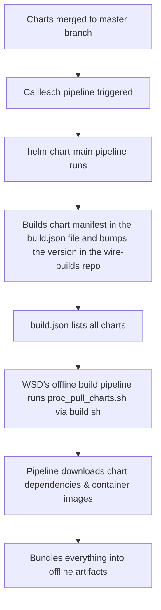

## Pipeline: Helm charts get pulled by the WSD pipeline to build the artifacts

Charts are coming from different sources, one of the soruce is [helm-charts](https://github.com/wireapp/helm-charts)
Once the charts from the helm-charts repo are merged to the master branch, the [cailleach pipeline](https://github.com/zinfra/cailleach), builds the chart manifest in a JSON file ([build.json](https://github.com/wireapp/wire-builds/blob/dev/build.json)) in the wire-builds repository via [helm-chart-main](https://github.com/zinfra/cailleach/blob/master/ci/pipelines/prod-ops/helm-charts-main.dhall) pipeline. All the charts in the `build.json` are pulled by the WSD's offline build pipeline via [proc_pull_charts](https://github.com/wireapp/wire-server-deploy/blob/master/offline/tasks/proc_pull_charts.sh),then the pipeline downloads dependencies, container images, and bundles them in the offline artifacts as part of the build process.

Flow chart of the build process:

