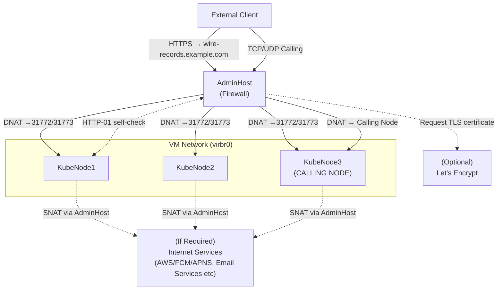

# Scope

**Wire in a Box (WIAB) Staging** is an installation of Wire running on a single physical machine using KVM-based virtual machines. This setup replicates the multi-node production Wire architecture in a consolidated environment suitable for testing, evaluation, and learning about Wire's infrastructure—but **not for production use**. The main use of this package is to verify that automation inside and outside of the wire product functions in the fashion you expect, before you run said automation in production. This will not test your network environment, load based behaviors, or the interface between wire and it's calling services when using a DMZ'd network configuration.

**Important:** This is a sandbox environment. Data from a staging installation cannot be migrated to production. WIAB Staging is designed for experimentation, validation, and understanding Wire's deployment model.

## Requirements

**Architecture Overview:**
- Multiple VMs (7) are deployed to simulate production infrastructure with separate roles (Kubernetes, data services, asset storage)
- All VMs share the same physical node and storage, creating a single failure domain
- [Calling services](https://docs.wire.com/latest/understand/overview.html#calling) will share the same k8s cluster as Wire services hence, all infrastructure will be DMZ (De-militarized zone).
- This solution helps developers understand Wire's infrastructure requirements and test deployment processes

**Resource Requirements:**
- One physical machine (aka `adminhost`) with hypervisor support:
  - **Memory:** 55 GiB RAM
  - **Compute:** 29 vCPUs  
  - **Storage:** 850 GB disk space (thin-provisioned)
  - 7 VMs with [Ubuntu 22](https://releases.ubuntu.com/jammy/) as per [required resources](#vm-provisioning)
- **DNS Records**: 
    - a way to create DNS records for your domain name (e.g. wire.example.com) 
    - Find a detailed explanation at [How to set up DNS records](https://docs.wire.com/latest/how-to/install/demo-wiab.html#dns-requirements)
- **SSL/TLS certificates**:
    - a way to create SSL/TLS certificates for your domain name (to allow connecting via https://)
    - To ease out the process of managing certs, we recommend using [Let's Encrypt](https://letsencrypt.org/getting-started/) & [cert-manager](https://cert-manager.io/docs/tutorials/acme/http-validation/)
- **Network**: No interference from UFW or other system specific firewalls, and IP forwarding enabled between network cards. An IP address reachable for ssh and which can act as entry point for Wire traffic.
- **Wire-server-deploy artifact**: A tar bundle containing all the required bash scripts, deb packages, ansible playbooks, helm charts and docker images to help with the installation. Reach out to [Wire support](https://support.wire.com/) to get access to the latest stable Wire artifact.

## VM Provisioning

We would require 7 VMs as per the following details, you can choose to use your own hypervisor to manage the VMs or use our [Wiab staging ansible playbook](https://github.com/wireapp/wire-server-deploy/blob/master/ansible/wiab-staging-provision.yml) against your physical node to setup the VMs.

**VM Architecture and Resource Allocation:**

| Hostname | Role | RAM | vCPUs | Disk |
|----------|------|-----|-------|------|
| assethost | Asset/Storage Server | 4 GiB | 2 | 100 GB |
| kubenode1 | Kubernetes Node 1 | 9 GiB | 5 | 150 GB |
| kubenode2 | Kubernetes Node 2 | 9 GiB | 5 | 150 GB |
| kubenode3 | Kubernetes Node 3 | 9 GiB | 5 | 150 GB |
| datanode1 | Data Node 1 | 8 GiB | 4 | 100 GB |
| datanode2 | Data Node 2 | 8 GiB | 4 | 100 GB |
| datanode3 | Data Node 3 | 8 GiB | 4 | 100 GB |
| **Total** | | **55 GiB** | **29** | **850 GB** |

*Note: These specifications are optimized for testing and validation purposes, not for performance benchmarking.*

**VM Service Distribution:**

- **kubenodes (kubenode1, kubenode2, kubenode3):** Run the Kubernetes cluster and host Wire backend services
- **datanodes (datanode1, datanode2, datanode3):** Run distributed data services:
  - Cassandra
  - PostgreSQL
  - Elasticsearch
  - Minio
  - RabbitMQ
- **assethost:** Hosts static assets to be used by kubenodes and datanodes

### Internet access for VMs:

In most cases, Wire Server components do not require internet access, except in the following situations:
- **External email services** – If your users’ email servers are hosted on the public internet (for example, user@gmail.com etc).
- **Mobile push notifications (FCM/APNS)** – Required to enable notifications for Android and Apple mobile devices. Wire uses [AWS services](https://docs.wire.com/latest/how-to/install/infrastructure-configuration.html#enable-push-notifications-using-the-public-appstore-playstore-mobile-wire-clients) to relay notifications to Firebase Cloud Messaging (FCM) and Apple Push Notification Service (APNS).
- **Third-party content previews** – If you want clients to display previews for services such as Giphy, Google, Spotify, or SoundCloud. Wire provides a proxy service for third-party content so clients do not communicate directly with these services, preventing exposure of IP addresses, cookies, or other metadata.
- **Federation with other Wire servers** – Required if your deployment needs to federate with another Wire server hosted on the public internet.

> **Note:** Internet access is also required by the cert-manager pods (via Let's Encrypt) to issue TLS certificates when manual certificates are not used.
>
> This internet access is temporarily enabled as described in [cert-manager behaviour in NAT / bridge environments](#cert-manager-behaviour-in-nat--bridge-environments) to allow certificate issuance. Once the certificates are successfully issued by cert-manager, the internet access is removed from the VMs.

## WIAB staging ansible playbook

The WIAB-staging ansible playbooks require internet access to be available on the target machine. Assuming it is available, these playbooks will perform the following steps automatically:

**System Setup & Networking**:
  - Updates all system packages and installs required tools (git, curl, docker, qemu, libvirt, yq, etc.)
  - Configures SSH and user permissions (sudo, kvm, docker groups)

**wire-server-deploy Artifact & Ubuntu Cloud Image**:
  - Downloads wire-server-deploy static artifact and Ubuntu cloud image
  - Extracts artifacts and sets proper file permissions
  - *Note: The wire-server-deploy artifact downloaded corresponds to the currently supported version*

**Libvirt Network Setup and VM Creation**:
  - Removes default libvirt network and creates custom "wirebox" network
  - Launches VMs using the `offline-vm-setup.sh` script with KVM
  - Creates an SSH key directory at `/home/ansible_user/wire-server-deploy/ssh` for VM access

**Ansible Inventory Generation**:
  - Generates inventory.yml with actual VM IPs replacing placeholders
  - Configures network interface variables for all k8s-nodes and datanodes

*Note: Skip the Ansible playbook step if you are managing VMs with your own hypervisor.* 

### Getting started with Ansible playbook

**Step 1: Obtain the ansible directory**

We need the whole ansible directory as ansible-playbook uses some templates for its operations. Choose one method to download the `wire-server-deploy/ansible` directory:

**Option A: Download as ZIP**
```bash
# requirements: wget and unzip
wget https://github.com/wireapp/wire-server-deploy/archive/refs/heads/master.zip
unzip master.zip
cd wire-server-deploy-master
```

**Option B: Clone with Git**
```bash
# requirements: git
git clone https://github.com/wireapp/wire-server-deploy.git
cd wire-server-deploy
```

**Step 2: Configure your Ansible inventory for your physical machine**

A sample inventory is available at [ansible/inventory/demo/wiab-staging.yml](https://github.com/wireapp/wire-server-deploy/blob/master/ansible/inventory/demo/wiab-staging.yml).
Replace example.com with the address of your physical machine (`adminhost`) where KVM is available. Make sure you set `ansible_user` and `ansible_ssh_private_key_file`. For `ansible_user`, The SSH user must have password-less `sudo` access. The adminhost must be running Ubuntu 22.04. From here on, we will refer the physical machine as `adminhost`.

The `private_deployment` variable determines whether the VMs created below will have internet access. When set to `true` (default value), no internet access is available to VMs. Check [Internet access for VMs](#internet-access-for-vms) to understand more about it.

**Step 3: Run the VM and network provision**

```bash
ansible-playbook -i ansible/inventory/demo/wiab-staging.yml ansible/wiab-staging-provision.yml
```

*Note: Ansible core version 2.16.3 or compatible is required for this step*

## Ensure secondary ansible inventory for VMs

Now you should have 7 VMs running on your `adminhost`. If you have used the ansible playbook, you should also have a directory `/home/ansible_user/wire-server-deploy` with all resources required for further deployment. If you didn't use the above playbook, download the `wire-server-deploy` artifact shared by Wire support and extract it with tar.

Ensure the inventory file `ansible/inventory/offline/inventory.yml` in the directory `/home/ansible_user/wire-server-deploy` contains values corresponding to your VMs. If you have already used the [Ansible playbook above](#getting-started-with-ansible-playbook) to set up VMs, this file should have been prepared for you.

The purpose of secondary ansible inventory is to interact only with the VMs. All the operations concerning the secondary inventory are meant to install datastores and k8s services.

## Next steps

Since the inventory is ready, please continue with the following steps:

> **Note**: All next steps assume that the wire-server-deploy artifact has been downloaded on the `adminhost` (your physical machine) and extracted at `/home/ansible_user/wire-server-deploy`. All commands from here on will be issued from this directory on the `adminhost`. Make sure you SSH into the node before proceeding.

### Environment Setup

- **[Generating secrets](docs_ubuntu_22.04.md#generating-secrets)**
  - Run `bin/offline-secrets.sh` to generate fresh secrets for Minio and coturn services. It uses the docker container images shipped inside the `wire-server-deploy` directory.
    ```bash
    ./bin/offline-secrets.sh
    ```
  - This creates following secret files:
    - `ansible/inventory/group_vars/all/secrets.yaml`
    - `values/wire-server/secrets.yaml`
    - `values/coturn/prod-secrets.example.yaml`

- **[Making tooling available in your environment](docs_ubuntu_22.04.md#making-tooling-available-in-your-environment)**
  - Source the `bin/offline-env.sh` shell script by running following command to set up a `d` alias that runs commands inside a Docker container with all necessary tools for offline deployment.
  ```bash
  source bin/offline-env.sh
  ```
  - You can always use this alias `d` later to interact with the ansible playbooks, k8s cluster and the helm charts.
  - The docker container mounts everything here from the `wire-server-deploy` directory, hence this acts an entry point for all the future interactions with ansible, k8s and helm charts.

### Kubernetes & Data Services Deployment

- **[Deploying Kubernetes and stateful services](docs_ubuntu_22.04.md#deploying-kubernetes-and-stateful-services)**
  ```bash
  d ./bin/offline-cluster.sh
  ```
  - Run the above command to deploy Kubernetes and stateful services (Cassandra, PostgreSQL, Elasticsearch, Minio, RabbitMQ). This script deploys all infrastructure needed for Wire backend operations.

### Helm Operations to install wire services and supporting helm charts

**Helm chart deployment (automated):** The script `bin/helm-operations.sh` will deploy the charts for you. It prepares `values.yaml`/`secrets.yaml`, customizes them for your domain/IPs, then runs Helm installs/upgrades in the correct order. Prepare the values before running it.

**User-provided inputs (set these before running):**
- `TARGET_SYSTEM`: your domain (e.g., `wire.example.com` or `example.dev`).
- `CERT_MASTER_EMAIL`: email used by cert-manager for ACME registration.
- `HOST_IP`: public IP that matches your DNS A record (auto-detected if empty).

**TLS / certificate behavior (cert-manager vs. Bring Your Own):**
- By default, `bin/helm-operations.sh` has `DEPLOY_CERT_MANAGER=TRUE`, which installs cert-manager and configures a Let’s Encrypt (HTTP-01) issuer for the ingress charts.
- If you **do not** want Let’s Encrypt / cert-manager (for example, you are using **[Bring Your Own certificates](docs_ubuntu_22.04.md#acquiring--deploying-ssl-certificates)**), disable this step by passing the environment variable `DEPLOY_CERT_MANAGER=FALSE` when running `bin/helm-operations.sh`.
  - When choosing `DEPLOY_CERT_MANAGER=FALSE`, ensure your ingress is configured with your own TLS secret(s) as described at [Acquiring / Deploying SSL Certificates](docs_ubuntu_22.04.md#acquiring--deploying-ssl-certificates).
  - When choosing `DEPLOY_CERT_MANAGER=TRUE`, ensure if further network configuration is required by following [cert-manager behaviour in NAT / bridge environments](#cert-manager-behaviour-in-nat--bridge-environments).

**To run the automated helm chart deployment with your variables**:
```bash
# example command - verify the variables before running it
d sh -c 'TARGET_SYSTEM="example.dev" CERT_MASTER_EMAIL="certmaster@example.dev" DEPLOY_CERT_MANAGER=TRUE ./bin/helm-operations.sh'
```

**Charts deployed by the script:**
- External datastores and helpers: `cassandra-external`, `elasticsearch-external`, `minio-external`, `rabbitmq-external`,`postgresql-external`, `databases-ephemeral`, `reaper`, `fake-aws`, `demo-smtp`.
- Wire services: `wire-server`, `webapp`, `account-pages`, `team-settings`, `smallstep-accomp`.
- Ingress and certificates: `ingress-nginx-controller`, `cert-manager`, `nginx-ingress-services`.
- Calling services: `sftd`, `coturn`.

**Values and secrets generation:**
- Creates `values.yaml` and `secrets.yaml` from `prod-values.example.yaml` and `prod-secrets.example.yaml` for each chart under `values/`.
- Backs up any existing `values.yaml`/`secrets.yaml` before replacing them.

*Note: The `bin/helm-operations.sh` script above deploys these charts; you do not need to run the Helm commands manually unless you want to customize or debug.*

## Network Traffic Configuration

### Bring traffic from the adminhost to Wire services in the k8s cluster

Our Wire services are ready to receive traffic but we must enable network access from the `adminhost` network interface to the k8s pods running in the virtual network. We can achieve it by setting up [nftables](https://documentation.ubuntu.com/security/security-features/network/firewall/nftables/) rules on the `adminhost`. When using any other type of firewall tools, please ensure following network configuration is achieved.

**Required Network Configuration:**

The `adminhost` must forward traffic from external clients to the Kubernetes cluster running Wire services. This involves:

1. **HTTP/HTTPS Traffic (Ingress)** – Forward external web traffic to Kubernetes ingress with load balancing across nodes
  - Port 80 (TCP, from any external source to adminhost WAN IP) → DNAT to any Kubernetes node on port 31772 → HTTP ingress
  - Port 443 (TCP, from any external source to adminhost WAN IP) → DNAT to any Kubernetes node on port 31773 → HTTPS ingress

2. **Calling Services Traffic (Coturn/SFT)** – Forward TURN control and media traffic to the dedicated calling node
  - Port 3478 (TCP/UDP, from any external source to adminhost WAN IP) → DNAT to calling node → TURN control traffic
  - Ports 32768–65535 (UDP, from any external source to adminhost WAN IP) → DNAT to calling node → WebRTC media relay

3. **Normal Access Rules (Host-Level Access)** – Restrict direct access to adminhost
  - Port 22 (TCP, from allowed sources to adminhost) → allow → SSH access
  - Traffic from loopback and VM bridge interfaces → allow → internal communication
  - Any traffic within VM network → allowed → ensures inter-node communication
  - All other inbound traffic to adminhost → drop → default deny policy

4. **Masquerading (If [Internet access for VMs](#internet-access-for-vms) is required)** – Enable outbound connectivity for VMs
  - Any traffic from VM subnet leaving via WAN interface → SNAT/masquerade → ensures return traffic from internet. 

5. **Conditional Rules (cert-manager / HTTP-01 in NAT setups)** – Temporary adjustments for certificate validation
  - DNAT hairpin traffic (VM → public IP → VM) → may require SNAT/masquerade on VM bridge → ensures return path during HTTP-01 self-checks
  - Asymmetric routing scenarios → may require relaxed reverse path filtering → prevents packet drops during validation



**Implementation:**

The nftables rules are detailed in [wiab_server_nftables.conf.j2](https://github.com/wireapp/wire-server-deploy/blob/master/ansible/files/wiab_server_nftables.conf.j2). Please ensure no other firewall services like `ufw` or `iptables` are configured on the node before continuing.

If you have already used the `wiab-staging-provision.yml` ansible playbook to create the VMs, then you can apply these rules using the same playbook (with the tag `nftables`) against your adminhost, by following:

```bash
ansible-playbook -i ansible/inventory/demo/wiab-staging.yml ansible/wiab-staging-provision.yml --tags nftables
```
Alternatively, if you have not used the `wiab-staging-provision.yml` ansible playbook to create the VMs but would like to configure nftables rules, you can invoke the ansible playbook [wiab-staging-nftables.yaml](https://github.com/wireapp/wire-server-deploy/blob/master/ansible/wiab-staging-nftables.yaml) against the physical node. The playbook is available in the directory `wire-server-deploy/ansible`.

The inventory file `inventory.yml` should define the following variables:
```yaml
wiab-staging:
  hosts:
    deploy_node:
      # this should be the adminhost
      ansible_host: example.com
      ansible_ssh_common_args: '-o StrictHostKeyChecking=no -o UserKnownHostsFile=/dev/null -o ServerAliveInterval=60 -o ServerAliveCountMax=3 -o TCPKeepAlive=yes'
      ansible_user: 'demo'
      ansible_ssh_private_key_file: "~/.ssh/id_ed25519"
  vars:
    # Kubernetes node IPs
    kubenode1_ip: 192.168.122.11
    kubenode2_ip: 192.168.122.12
    kubenode3_ip: 192.168.122.13
    # Calling services node(kubenode3)
    calling_node_ip: 192.168.122.13
    wire_comment: "wiab-stag"
    # it will disable internet access to VMs created on the private network
    private_deployment: true
    # the playbook will try to find the default interface i.e. INF_WAN from ansible_default_ipv4.interface
```

To implement the nftables rules, execute the following command:
```bash
# assuming the inventory.yml storead at wire-server-deploy and run command from the same directory
ansible-playbook -i inventory.yml ansible/wiab-staging-nftables.yaml
```

### cert-manager behaviour in NAT / bridge environments

When cert-manager performs HTTP-01 self-checks inside the cluster, traffic can hairpin:

- Pod → Node → host public IP → DNAT → Node → Ingress

> **Note**: Using Let's encrypt with `cert-manager` requires internet access ([to at least `acme-v02.api.letsencrypt.org`](https://letsencrypt.org/docs/acme-protocol-updates/)) to issue TLS certs. If you have chosen to keep the network private i.e. `private_deployment=true` for the VMs when applying nftables rules aka no internet access to VMs, then we need to make a temporary exception for this.
>
> To add a nftables masquerading rule for all outgoing traffic from your Wire environment, run the following command on the `adminhost`:
>
> ```bash
>   # Host WAN interface name
>   INF_WAN=enp41s0
>   sudo nft insert rule ip nat POSTROUTING position 0 \
>     oifname $INF_WAN \
>     counter masquerade \
>     comment "wire-masquerade-for-letsencrypt"
> ```
>
> If you are using a different implementation than nftables then please ensure Internet access to VMs.

In NAT/bridge setups (for example, using `virbr0` on the host):

- If nftables DNAT rules exist in `PREROUTING` without a matching SNAT on `virbr0 → virbr0`, return packets may bypass the host and break conntrack, causing HTTP-01 timeouts and certificate verification failures.
-  too strict of `rp_filter` settings can drop asymmetric return packets.

Before changing anything, first verify whether certificate issuance is actually failing:

1. Check whether certificates are successfully issued:
  ```bash
  d kubectl get certificates
  ```
2. Check if k8s pods can access to its own domain:
  ```bash
  # Replace <your-domain> below. To find the aws-sns pod id, run the command:
  # d kubectl get pods -l 'app=fake-aws-sns'
  d kubectl exec -ti fake-aws-sns-<pod-id> -- sh -c 'curl --connect-timeout 10 -v webapp.<your-domain>'
  ```
3. If certificates are not in `Ready=True` state, inspect cert-manager logs for HTTP-01 self-check or timeout errors:
  ```bash
  # To find the <cert-manager-pod-id>, run the following command:
  # d kubectl get pods -n cert-manager-ns -l 'app=cert-manager'
  d kubectl logs -n cert-manager-ns <cert-manager-pod-id>
  ```

If you observe HTTP-01 challenge timeouts or self-check failures in a NAT/bridge environment, hairpin SNAT and relaxed reverse-path filtering handling may be required. One possible approach is by making following changes to the adminhost:

- Relax reverse-path filtering to loose mode to allow asymmetric flows:
  ```bash
  sudo sysctl -w net.ipv4.conf.all.rp_filter=2
  sudo sysctl -w net.ipv4.conf.virbr0.rp_filter=2
  ```
  These settings help conntrack reverse DNAT correctly and avoid drops during cert-manager’s HTTP-01 challenges in NAT/bridge (`virbr0`) environments.

- Enable Hairpin SNAT (temporary for cert-manager HTTP-01):
  ```bash
  sudo nft insert rule ip nat POSTROUTING position 0 \
    iifname "virbr0" oifname "virbr0" \
    ip daddr 192.168.122.0/24 ct status dnat \
    counter masquerade \
    comment "wire-hairpin-dnat-virbr0"
  ```
  This forces DNATed traffic that hairpins over the bridge to be masqueraded, ensuring return traffic flows back through the host and conntrack can correctly reverse the DNAT.

  Verify the rule was added:
  ```bash
  sudo nft list chain ip nat POSTROUTING
  ```
  You should see a rule similar to:
  ```
  iifname "virbr0" oifname "virbr0" ip daddr 192.168.122.0/24 ct status dnat counter masquerade # handle <id>
  ```

- Remove the rule after certificates are issued, confirm by running the following:
  ```bash
  d kubectl get certificates
  ```

  Once Let’s Encrypt validation completes and certificates are issued, remove the temporary hairpin SNAT rule. Use the following pipeline to locate the rule handle and delete it safely:
  ```bash
  sudo nft -a list chain ip nat POSTROUTING | \
    grep wire-hairpin-dnat-virbr0 | \
    sed -E 's/.*handle ([0-9]+).*/\1/' | \
    xargs -r -I {} sudo nft delete rule ip nat POSTROUTING handle {}
  ```

> **Note**: If above you had made an exception to allow temporary internet access to VMs by adding a nftables rules, then this should be removed now.
>
> To remove the nftables masquerading rule for all outgoing traffic run the following command:
>
> ```bash
>  # remove the masquerading rule
>  sudo nft -a list chain ip nat POSTROUTING | \
>    grep wire-masquerade-for-letsencrypt | \
>    sed -E 's/.*handle ([0-9]+).*/\1/' | \
>    xargs -r -I {} sudo nft delete rule ip nat POSTROUTING handle {}
> ```
>
> If you are using a different implementation than nftables then please ensure temporary Internet access to VMs has been removed.

For additional background on when hairpin NAT is required and how it relates to WIAB Dev and WIAB Staging, see [Hairpin networking for WIAB Dev and WIAB Staging](tls-certificates.md#hairpin-networking-for-wiab-dev-and-wiab-staging).

## Further Reading

- **[Deploying stateless services and other dependencies](docs_ubuntu_22.04.md#deploying-stateless-dependencies)**: Read more about external datastores and stateless dependencies.
- **[Deploying Wire Server](docs_ubuntu_22.04.md#deploying-wire-server)**: Read more about core Wire backend deployment and required values/secrets.
- **[Deploying webapp](docs_ubuntu_22.04.md#deploying-webapp)**: Read more about webapp deployment and domain configuration.
- **[Deploying team-settings](docs_ubuntu_22.04.md#deploying-team-settings)**: Read more about team settings services.
- **[Deploying account-pages](docs_ubuntu_22.04.md#deploying-account-pages)**: Read more about account management services.
- **[Deploying smallstep-accomp](docs_ubuntu_22.04.md#deploying-smallstep-accomp)**: Read more about the ACME companion.
- **[Enabling emails for wire](smtp.md)**: Read more about SMTP options for onboarding email delivery and relay setup.
- **[Deploy ingress-nginx-controller](docs_ubuntu_22.04.md#deploy-ingress-nginx-controller)**: Read more about ingress configuration and traffic forwarding requirements.
- **[Acquiring / Deploying SSL Certificates](docs_ubuntu_22.04.md#acquiring--deploying-ssl-certificates)**: Read more about TLS options (Bring Your Own or cert-manager) and certificate requirements.
- **[Installing SFTD](docs_ubuntu_22.04.md#installing-sftd)**: Read more about the Selective Forwarding Unit (SFT) and related configuration.
- **[Installing Coturn](coturn.md)**: Read more about TURN/STUN setup for WebRTC connectivity and NAT traversal.
- **[Configure the port redirection in Nftables](coturn.md#configure-the-port-redirection-in-nftables)**: Read more about configuring Nftables rules
